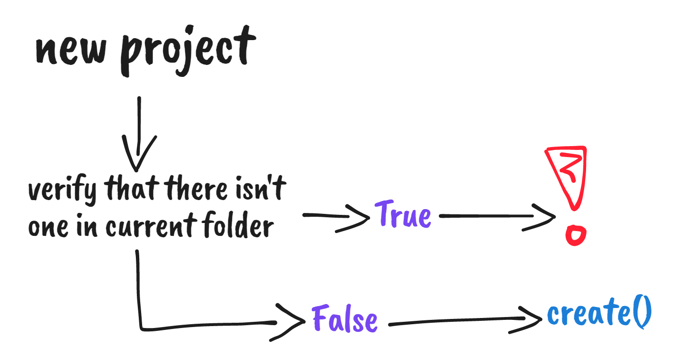
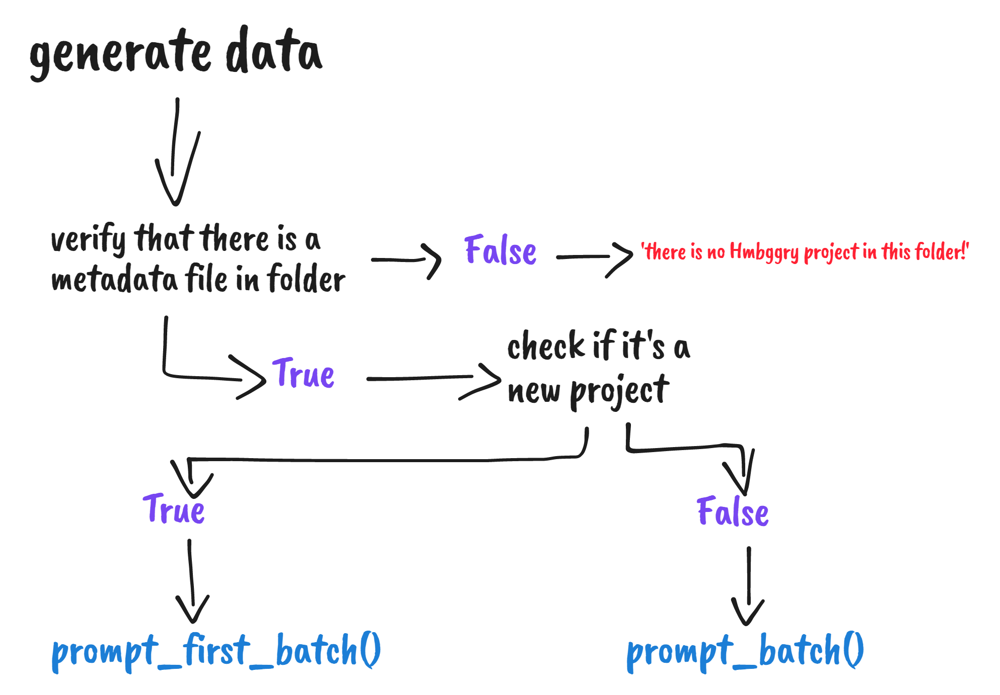

# Introduction

## Installation

Create a new virtual environment or use an exisiting one.

---

## Creating a project

If not in an exisintg project folder, calling generate will create a new folder with a bare structure: folder + small metadata file.

## Generating data

--> How it works

